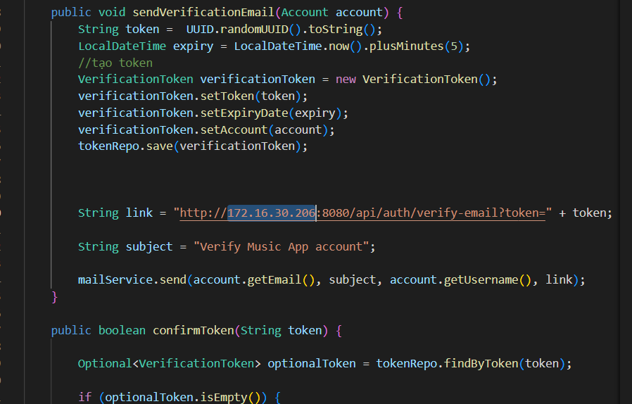
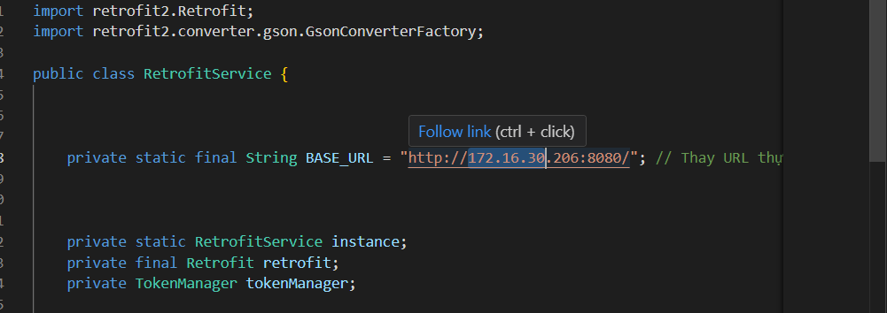

# App nghe nhạc này được làm bằng**     
**Front-end:** Android studio viết bằng java.   
**Back-end:** IntelliJ IDEA, spring boot.

**Video demo:** [Video hướng dẫn trên YouTube](https://youtu.be/EA7DacRWoPk)

**Đây chỉ dành cho việc học tập, không được dùng để kiếm tiền**

# Để có thể chạy trên localhost
**Nhớ tạo database_test đã đc cung cấp để tạo**

Bạn cần chỉnh 2 ip của 2 file thành ip hiện tại của mình(Mở terminal và gõ ipconfig) **RetrofitService(Frontend)** và **VeriVerifyEmailService(Backend)**

**VeriVerifyEmailService(Backend)**

**RetrofitService(Frontend)**

## APP hiện tại sử dụng các bài hát từ NCS để test và không có dùng cho mục đích thương mại.
## Hiện tai database chỉ luôn các đường link dẫn tới bài hát(được lưu ở drive, nên nếu data bị lỗi thì rất có thể chỗ lưu test trên drive đã bị xoá hoặc thay đổi. Khi ấy hãy đổi bằng chính đường link của bạn)

## APP hiện tại còn khá nhiều hạn chế và chưa ứng dụng hết các use case vào project. Mong mọi người thông cảm.

