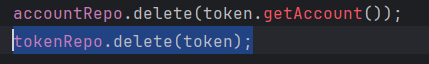
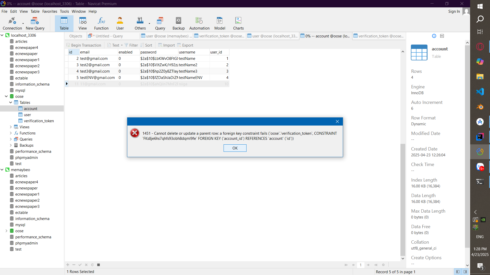
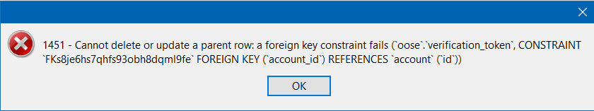
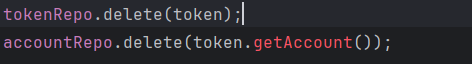
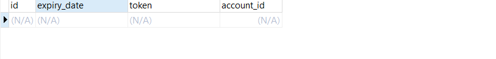
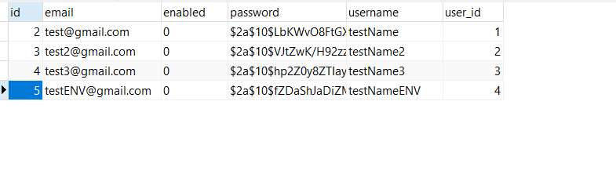

## 2 dòng code

## Nó se có nghĩa là m đang delete 1 thằng cha với 1 cái key constrain với 1 thằng con nên nếu thằng cha mất trước thằng con đéo biết ở đâu gắn vào cái nào nên đéo cho xóa

## Đảo lại

## Thì nó sẽ delete thằng con trước sau đó mới delete được thằng cha

